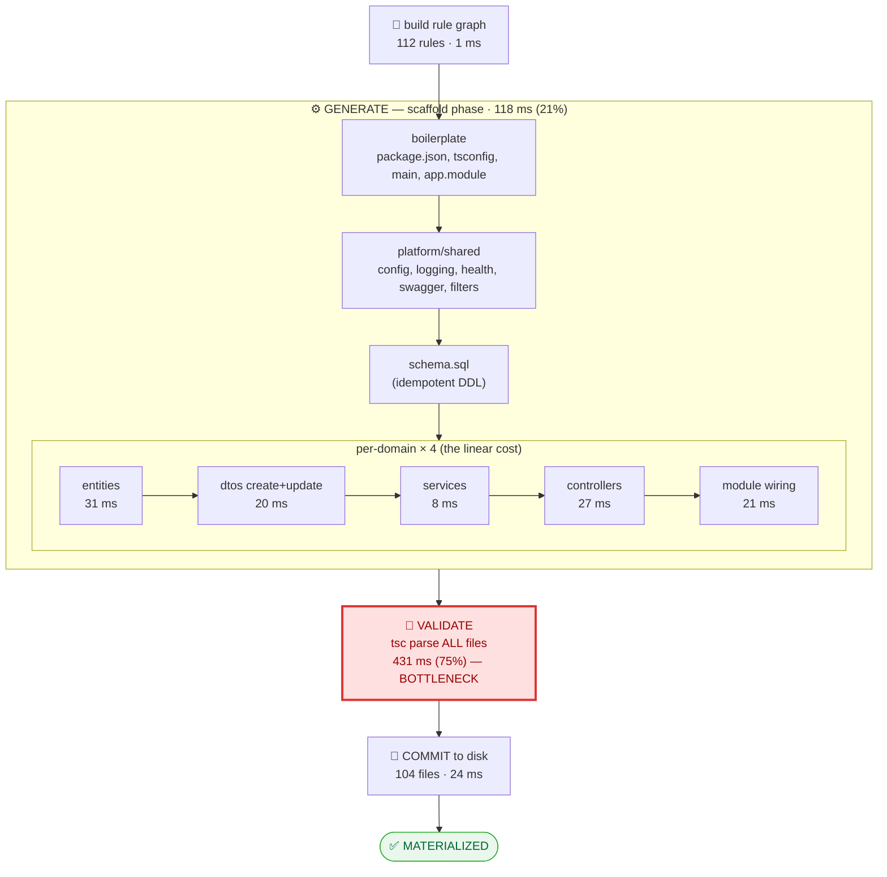

# Archon Materialization Timeline

> An "invented" diagram type for visualizing **how a project gets generated** — the
> order of operations, what is produced first/second/…, and **where the bottleneck is**.
> Numbers below are *measured* from a real run of the conference demo spec
> (4 domains, 15 entities, 13 services → **104 files**, **~575 ms** wall clock).

---

## 1. The Materialization Waterfall (the invented view)

A **time-proportional waterfall**: stages run top-to-bottom in execution order, and
each bar's width is its share of wall-clock time. The longest bar is, by construction,
the bottleneck — you *see* it instead of reading it.

```
ARCHON MATERIALIZATION WATERFALL        total ≈ 575 ms · 104 files · 112 rules
scale: each █ ≈ 7 ms                                            time ─────────▶

PLAN
  build 112 rules      ▏                                                    1 ms   0.2%

GENERATE  (118 ms · 21%)        ← scales with #entities × #services
  entities (15)        █████                                              31 ms   27%*
  controllers          ████                                               27 ms   23%*
  modules              ███                                                21 ms   18%*
  dtos (create+update) ███                                                20 ms   17%*
  services             █                                                   8 ms    7%*
  schema/platform/docs ██                                                 11 ms    7%*

VALIDATE  (431 ms · 75%)   ◀━━━━━━━━━━━━━━━━━━━━━━━━  🔴 BOTTLENECK
  tsc parse ALL files  ████████████████████████████████████████████████████████████  431 ms

PERSIST
  commit 104 files     ███                                                24 ms   4%

(* percentages within the GENERATE phase)
```

**Reading it:** generation is cheap and linear in the number of entities; the wall-clock
is dominated by the **TypeScript validation pass**, which re-parses every generated file
to guarantee the output compiles. Disk I/O (commit) is negligible.

---

## 2. The Pipeline (order + dependency + critical path)

Same run, shown as a dependency flow. The phases are strictly sequential
(`scaffold → validate → commit`); inside `scaffold`, the per-domain artifacts are the
bulk of the work.



---

## 3. What this tells us

| Observation | Implication |
| :--- | :--- |
| **Validation = 75% of wall time** | The bottleneck is *correctness checking*, not code generation. It's a fixed tax that grows with total LOC. |
| Generation is ~linear in entities | Cost ≈ `entities × (entity+dto+service+controller+module)`. 15 entities ≈ 118 ms; doubling entities ≈ doubles generation, not validation-per-file. |
| Commit (disk) is ~4% | The VFS batches writes; I/O is not the problem. |
| build_rules is ~0% | Planning the 112-rule graph is free. |

### Where to optimize (if/when needed)
1. **Validation** — it parses every file from scratch. Options: validate only *changed* files on incremental regen (the spec-delta gate already knows the impacted set), reuse a single ts-morph `Project` across rules instead of re-parsing, or run validation in a worker pool.
2. **Generate** — already cheap; the only lever is parallelizing the independent per-entity rules (they have no cross-dependencies until the `app.module` wiring step).

> Regenerated/incremental runs shift the mix: the `merge` phase (ts-morph AST merge that
> preserves `@ArchonManual` code) is added, and validation can be scoped to impacted files —
> turning the waterfall from "validation-dominated" into "merge-dominated".

---

## 4. The generation strategy (the ordering algorithm)

Generation is ordered at **two altitudes**:

**Domain level — Kahn topological sort.** When shards compile into `DesignSpec.json`,
domains are ordered by their `dependsOn` graph via Kahn's algorithm
(`servers/archon/src/tools/core/shards.ts`). A domain is emitted only after the
domains it depends on; cycles are detected and rejected.

**File level — phased topological layers.** `RuleRunner` orders rules by:
```
phase (scaffold → merge → validate)  →  layer (0..n)  →  id
```
- **Phases** are the coarse dependency bands: write all files (`scaffold`), then wire
  cross-references into shared files (`merge`: imports + Nest module registration +
  package.json deps), then `validate`. Cross-file edits are deferred to `merge` and are
  idempotent, so scaffold files never depend on each other's existence.
- **Layers** (`ArchonRule.layer`) encode the artifact lattice *within* the scaffold phase
  so intra-phase order is intentional, not alphabetical:
  `entities(0) → dtos(1) → services(2) → controllers(3) → module(4)`.
  Rules in the same layer are mutually independent (distinct output files).

**Parallelism (deferred, on purpose).** Same-layer rules are independent and *could* run
in parallel, but two shared resources make naive `Promise.all` unsafe today: the single
ts-morph `Project` in `AstEditor` (used by the merge path) and concurrent writes to shared
files (`package.json`, `app.module.ts`). Template rendering is also CPU-bound and
single-threaded, so in-process `Promise.all` would yield little. The layer tags make the
parallelizable batches explicit for a **future worker-thread executor**, where true
parallelism is possible without shared-state races. Until then execution is sequential and
deterministic — and the real wall-clock win comes from scoping validation (the 75% band).

---

## 5. Validation is already incremental

The 431 ms (75%) validation band applies to a **full** generation only. `TypescriptParseValidator`
validates `vfs.listChanges()` — i.e. only files touched in the current run — reusing a single
ts-morph `Project`, plus a fast-path that skips Project construction when no `.ts` changed.

Measured:
```
full generation        : ~570 ms,  88 .ts files validated
no-spec-change re-gen   :  ~62 ms,   0 .ts files validated   (~9× faster)
```
So evolving one field only re-validates the touched module. Full-generation validation cost is
inherent (all generated code must be checked at least once); the lever there is the future
worker-thread executor from §4, not re-scoping.
